# General Journal Bookkeeping in Sage 50

**Binh's Bins: one month of transactions, corrections, backups and financial reports**

Work sample by Alireza Abbaspour | Sage 50 Premium Accounting 2025 (Canadian Edition)

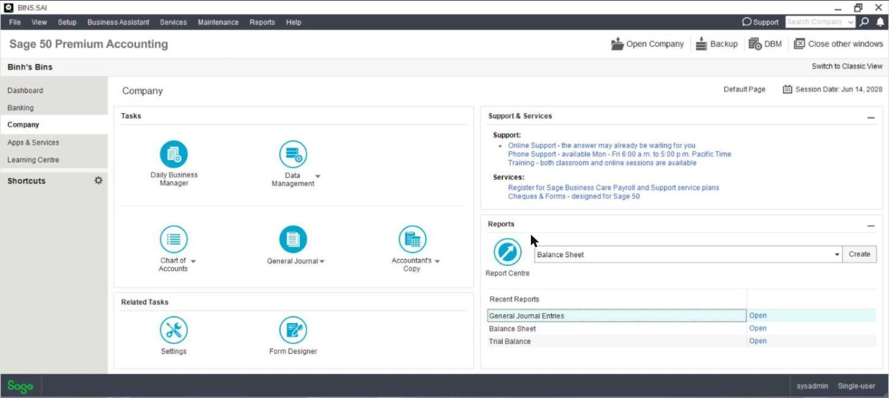 <em>Figure 1. Sage 50 home window for the Binh's Bins company file</em>

## Contents

1. [Overview](#1-overview)
2. [Company file and session dates](#2-company-file-and-session-dates)
3. [Journal entry procedure](#3-journal-entry-procedure)
4. [Transaction record](#4-transaction-record)
5. [New ledger accounts](#5-new-ledger-accounts)
6. [Corrections to posted entries](#6-corrections-to-posted-entries)
7. [Backups](#7-backups)
8. [Reporting](#8-reporting)
9. [Skills demonstrated](#9-skills-demonstrated)

## 1. Overview

This document records a full month of general-journal bookkeeping for Binh's Bins, a dumpster rental business, in Sage 50 Premium Accounting 2025. It covers every transaction for June 2028, from source document to posted entry, followed by the month-end adjustments, corrections, backups and financial reports. Binh's Bins is a sample company file; all screenshots are from the working file in Sage 50.

| Item | Result |
|---|---|
| Transactions recorded | 28 source documents: purchase and sales invoices, cheques, receipts, bank memos and internal memos |
| Journal entries posted | 30 (J1 to J30), including two reversing entries generated by corrections |
| New ledger accounts created | 6 (one loan, two customer and three supplier accounts) |
| Posted entries corrected | 2, using Adjust a Previously Posted Entry with a full audit trail |
| Backups taken | 5, one at the end of each working session |
| Reports produced | General Journal, Trial Balance, Income Statement, Comparative Balance Sheet, General Ledger (4 accounts), Chart of Accounts, Account List; all exported to PDF |
| Closing Trial Balance | Debits 718,610.00 = Credits 718,610.00 |

GST at 5% was recorded on every taxable purchase (2670 GST Paid on Purchases) and sale (2650 GST Charged on Services).

## 2. Company file and session dates

The work was done in five sessions. Sage 50 does not accept an entry dated after the session date, so the session date was advanced at the start of each session and a backup was taken at the end.

| Session | Session date | Transactions | Journal entries | Backup file |
|---|---|---|---|---|
| 1 | Jun 07, 2028 | 1 to 8 | J1 to J9 | Backup BINS_Session1 |
| 2 | Jun 14, 2028 | 9 to 14 | J10 to J15 | Backup BINS_Session2 |
| 3 | Jun 21, 2028 | 15 to 20 | J16 to J21 | Backup BINS_Session3 |
| 4 | Jun 28, 2028 | 21 to 24 | J22 to J25 | Backup BINS_Session4 |
| 5 | Jun 30, 2028 | 25 to 28 | J26 to J30 | Backup BINS_Session5 |

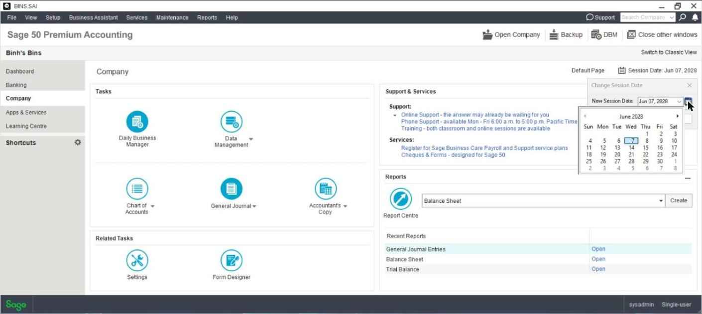 <em>Figure 2. Change Session Date dialog with the calendar picker</em>

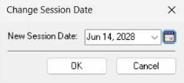 <em>Figure 3. New session date selected</em>

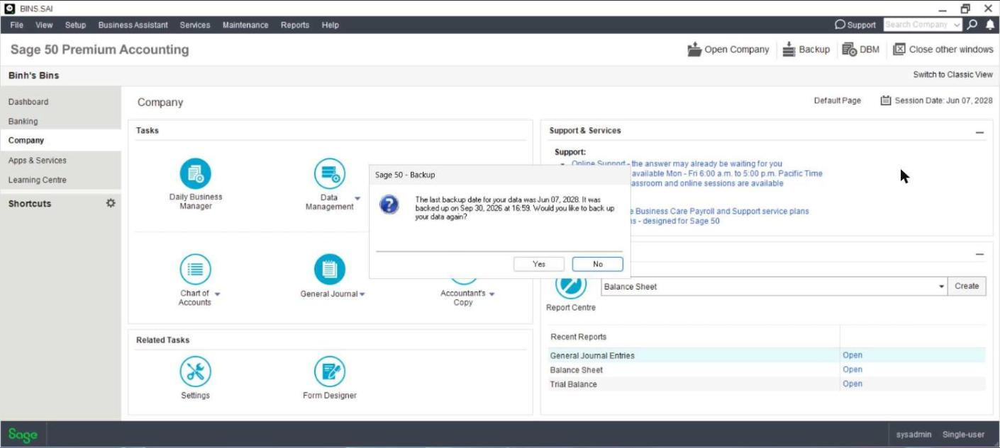 <em>Figure 4. Sage prompts for a backup when the session date is advanced</em>

## 3. Journal entry procedure

Every transaction was entered in the General Journal using the same routine.

1. Set the transaction date from the calendar picker.
2. Enter the source document number in **Source** and a description (party and purpose) in **Comment**.
3. Enter each account number, then its debit or credit amount.
4. Check that the Debits and Credits totals agree, and check the GST line against 5% of the net amount.
5. Review the entry with **Report > Display General Journal Entry** where needed, then **Post**.
6. Note the journal entry number in the confirmation.

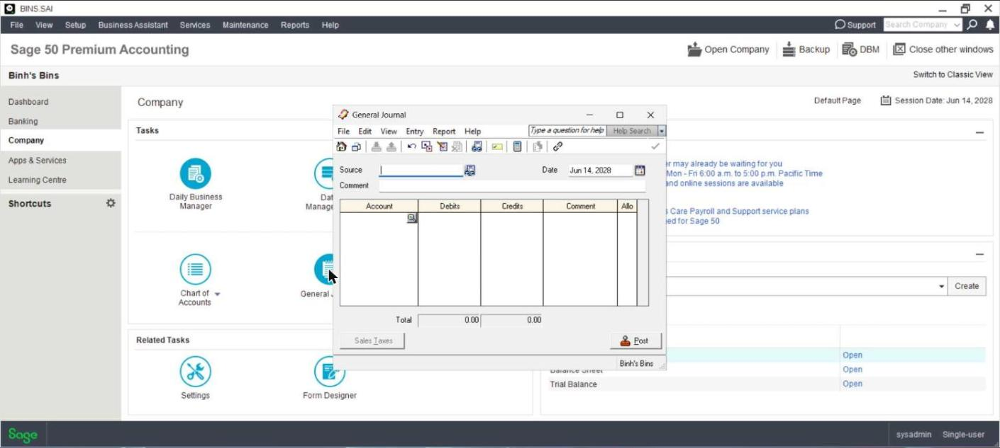 <em>Figure 5. Blank General Journal form</em>

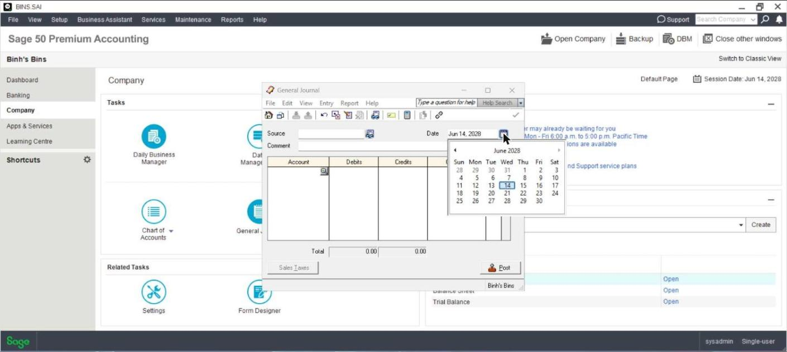 <em>Figure 6. Selecting the transaction date</em>

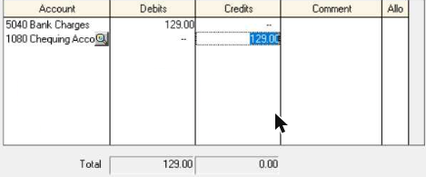 <em>Figure 7. Sage proposes the balancing amount on the last line</em>

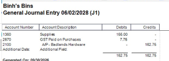 <em>Figure 8. Journal entry preview before posting (J1)</em>

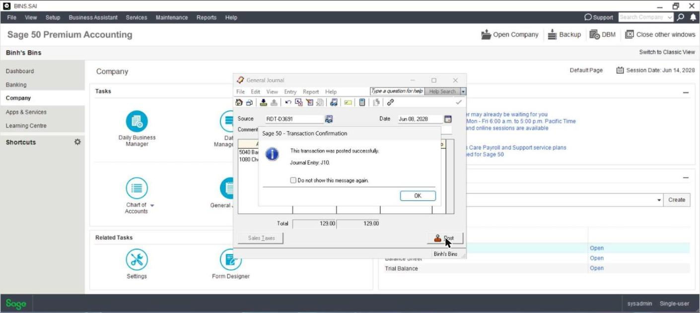 <em>Figure 9. Posting confirmation with the journal entry number</em>

## 4. Transaction record

The table lists all 28 transactions. A screenshot of each completed entry, taken before posting, follows by session.

| # | Date | Source | Description | Entry | JE |
|---|---|---|---|---|---|
| 1 | Jun 2 | BH-5621 | Badlands Hardware, paint and stencils | Dr 1360 155.00 Dr 2670 7.75 Cr 2100 162.75 | J1 |
| 2 | Jun 3 | RDT-C4778 | Red Deer Trust, bank loan deposited | Dr 1080 40,000.00 Cr 2250 40,000.00 | J2 |
| 3 | Jun 3 | HC-7655 | Hoodoos Containers, dumpsters | Dr 1560 35,550.00 Dr 2670 1,777.50 Cr 2120 37,327.50 | J3 |
| 4 | Jun 2 | Memo #1 | Correct BH-5621 to 178.50 | Dr 1360 170.00 Dr 2670 8.50 Cr 2100 178.50 | J4, J5 |
| 5 | Jun 5 | Cheque #488 | Pay Red Deer Promotions, RDP-8668 | Dr 2180 2,940.00 Cr 1080 2,940.00 | J6 |
| 6 | Jun 5 | Receipt #120 | Redbird Brothers, invoice BB-351 | Dr 1080 5,880.00 Cr 1240 5,880.00 | J7 |
| 7 | Jun 6 | BB-363 | Watershed Insurance, dumpster rentals | Dr 1260 6,720.00 Cr 4100 6,400.00 Cr 2650 320.00 | J8 |
| 8 | Jun 6 | SM-6111 | Sylvan Motors, lube, oil and filters | Dr 5150 960.00 Dr 2670 48.00 Cr 2200 1,008.00 | J9 |
| 9 | Jun 8 | RDT-D3691 | Bank service charges | Dr 5040 129.00 Cr 1080 129.00 | J10 |
| 10 | Jun 10 | WD-4499 | Western Data, dispatch software | Dr 1520 840.00 Dr 2670 42.00 Cr 2220 882.00 | J11 |
| 11 | Jun 11 | Chq #489 / Memo #2 | Reimburse owner for phone bill | Dr 5140 344.00 Dr 2670 17.20 Cr 1080 361.20 | J12 |
| 12 | Jun 11 | Cheque #490 | Pay Hoodoos Containers, HC-7655 | Dr 2120 37,327.50 Cr 1080 37,327.50 | J13 |
| 13 | Jun 12 | Receipt #121 | Ontime Contracting, invoice BB-338 | Dr 1080 2,730.00 Cr 1200 2,730.00 | J14 |
| 14 | Jun 14 | BB-364 | Piper Creek Mall, dumpster rentals | Dr 1220 3,990.00 Cr 4100 3,800.00 Cr 2650 190.00 | J15 |
| 15 | Jun 15 | SM-7941 | Sylvan Motors, truck repairs | Dr 5100 1,900.00 Dr 2670 95.00 Cr 2200 1,995.00 | J16 |
| 16 | Jun 18 | Cheque #491 | Pay Badlands Hardware, BH-5621 | Dr 2100 178.50 Cr 1080 178.50 | J17 |
| 17 | Jun 19 | BB-365 | Sunnybrook Estates, dumpster rentals | Dr 1280 5,040.00 Cr 4100 4,800.00 Cr 2650 240.00 | J18 |
| 18 | Jun 20 | Cheque #492 | Pay Western Data, WD-4499 (entered as 842) | Dr 2220 842.00 Cr 1080 842.00 | J19 |
| 19 | Jun 20 | BB-366 | Ontime Contracting, subcontracting | Dr 1200 10,605.00 Cr 4150 10,100.00 Cr 2650 505.00 | J20 |
| 20 | Jun 21 | Receipt #122 | Watershed Insurance, invoice BB-363 | Dr 1080 6,720.00 Cr 1260 6,720.00 | J21 |
| 21 | Jun 24 | BB-367 | Watershed Insurance, dumpster rentals | Dr 1260 2,520.00 Cr 4100 2,400.00 Cr 2650 120.00 | J22 |
| 22 | Jun 25 | BP-2194 | Beaver Ponds Paving, parking resurfacing | Dr 5100 4,040.00 Dr 2670 202.00 Cr 2240 4,242.00 | J23 |
| 23 | Jun 25 | RDP-822 / Chq #493 | Red Deer Promotions, website redesign | Dr 5020 900.00 Dr 2670 45.00 Cr 1080 945.00 | J24 |
| 24 | Jun 28 | Cheque #494 | Owner drawings, personal expense | Dr 3150 2,290.00 Cr 1080 2,290.00 | J25 |
| 25 | Jun 30 | Memo #3 | Prepaid insurance and rent expired | Dr 5060 1,000.00 Cr 1320 1,000.00 Dr 5120 1,800.00 Cr 1340 1,800.00 | J26 |
| 26 | Jun 30 | Receipt #123 | Sunnybrook Estates, invoice BB-365 | Dr 1080 5,040.00 Cr 1280 5,040.00 | J27 |
| 27 | Jun 30 | RDT-D7448 | Wages paid to 3 employees | Dr 5160 10,500.00 Cr 1080 10,500.00 | J28 |
| 28 | Jun 20 | Memo #4 | Correct Cheque #492 to 882 | Dr 2220 882.00 Cr 1080 882.00 | J29, J30 |

### Session 1: June 1 to 7

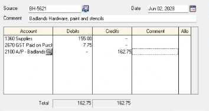 <em>Figure 10. 1. Purchase invoice BH-5621 (J1)</em>

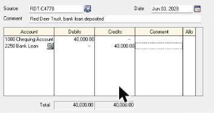 <em>Figure 11. 2. Bank loan RDT-C4778 (J2)</em>

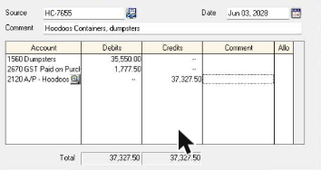 <em>Figure 12. 3. Purchase invoice HC-7655 (J3)</em>

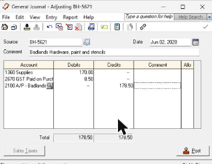 <em>Figure 13. 4. Memo #1: BH-5621 adjusted to 178.50 (J4, J5)</em>

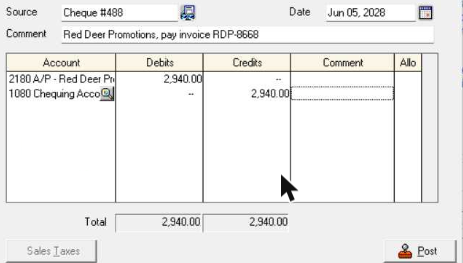 <em>Figure 14. 5. Cheque #488 (J6)</em>

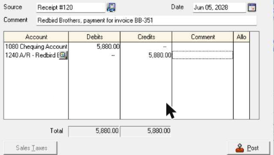 <em>Figure 15. 6. Receipt #120 (J7)</em>

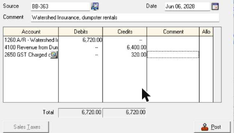 <em>Figure 16. 7. Sales invoice BB-363 (J8)</em>

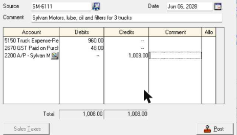 <em>Figure 17. 8. Purchase invoice SM-6111 (J9)</em>

### Session 2: June 8 to 14

 <em>Figure 18. 9. Bank debit memo RDT-D3691 (J10)</em>

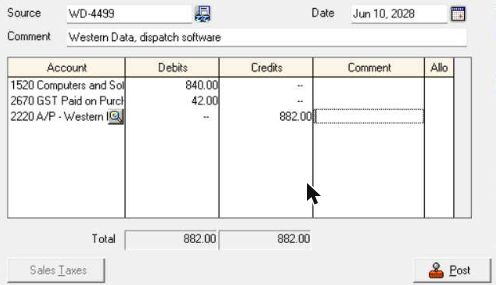 <em>Figure 19. 10. Purchase invoice WD-4499 (J11)</em>

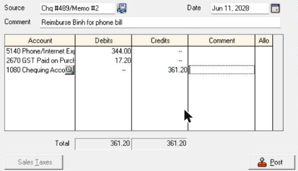 <em>Figure 20. 11. Cheque #489 / Memo #2 (J12)</em>

 <em>Figure 21. 12. Cheque #490 (J13)</em>

 <em>Figure 22. 13. Receipt #121 (J14)</em>

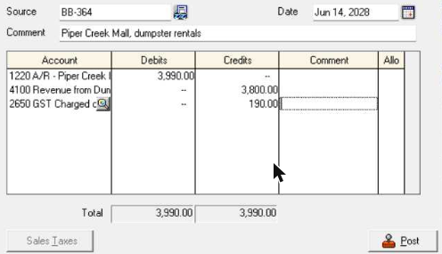 <em>Figure 23. 14. Sales invoice BB-364 (J15)</em>

### Session 3: June 15 to 21

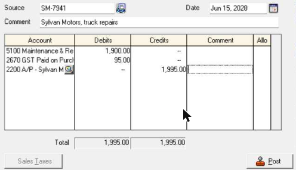 <em>Figure 24. 15. Purchase invoice SM-7941 (J16)</em>

 <em>Figure 25. 16. Cheque #491 (J17)</em>

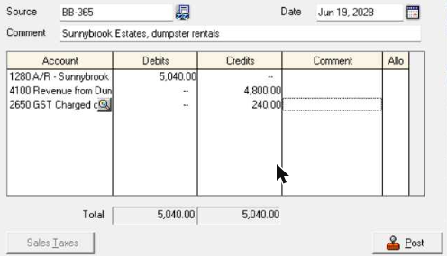 <em>Figure 26. 17. Sales invoice BB-365 (J18)</em>

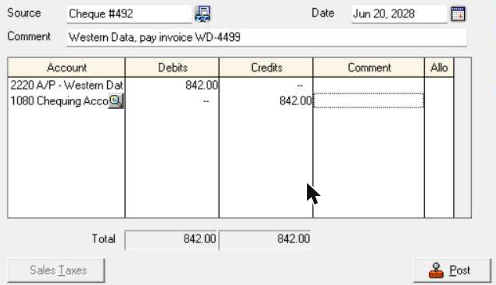 <em>Figure 27. 18. Cheque #492, entered as 842 (J19)</em>

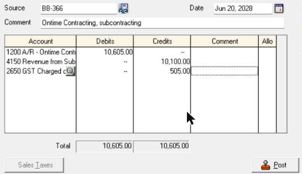 <em>Figure 28. 19. Sales invoice BB-366 (J20)</em>

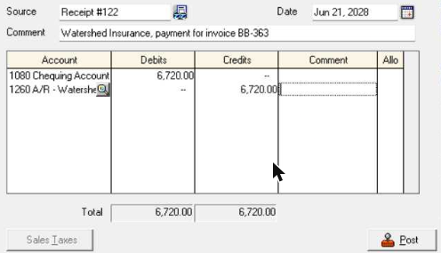 <em>Figure 29. 20. Receipt #122 (J21)</em>

### Session 4: June 22 to 28

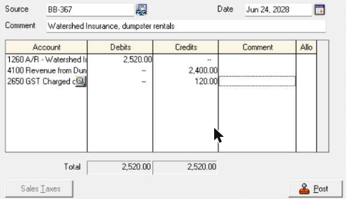 <em>Figure 30. 21. Sales invoice BB-367 (J22)</em>

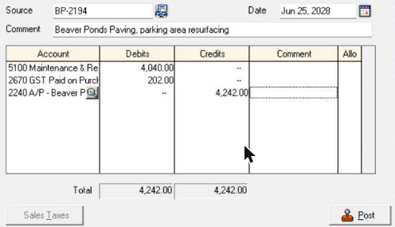 <em>Figure 31. 22. Purchase invoice BP-2194 (J23)</em>

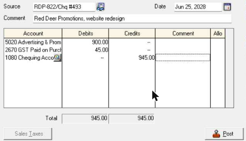 <em>Figure 32. 23. Cash purchase RDP-822, Cheque #493 (J24)</em>

 <em>Figure 33. 24. Cheque #494, owner drawings (J25)</em>

### Session 5: June 29 to 30

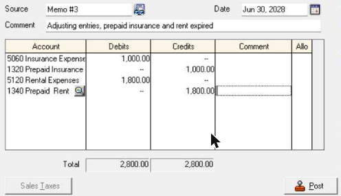 <em>Figure 34. 25. Memo #3, adjusting entries (J26)</em>

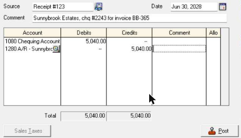 <em>Figure 35. 26. Receipt #123 (J27)</em>

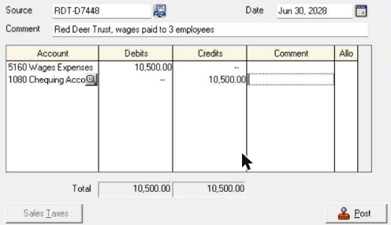 <em>Figure 36. 27. Bank debit memo RDT-D7448, wages (J28)</em>

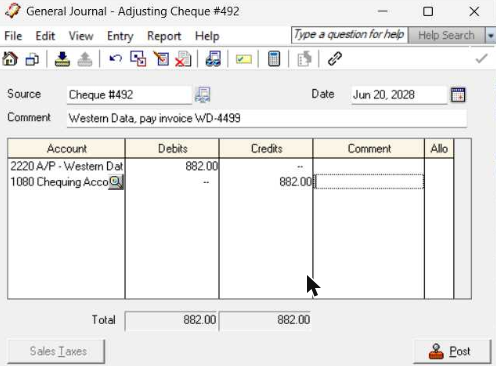 <em>Figure 37. 28. Memo #4: Cheque #492 adjusted to 882 (J29, J30)</em>

## 5. New ledger accounts

Six accounts did not exist in the chart of accounts and were created from inside the journal entry with the Add an Account wizard. Each was set up as a postable group account in the class matching its number range, with no subtotal, to match the existing customer and supplier accounts.

| Number | Name | Class | First used |
|---|---|---|---|
| 2250 | Bank Loan | Liability | Transaction 2 |
| 1260 | A/R - Watershed Insurance | Asset | Transaction 7 |
| 2200 | A/P - Sylvan Motors | Liability | Transaction 8 |
| 2220 | A/P - Western Data | Liability | Transaction 10 |
| 1280 | A/R - Sunnybrook Estates | Asset | Transaction 17 |
| 2240 | A/P - Beaver Ponds Paving | Liability | Transaction 22 |

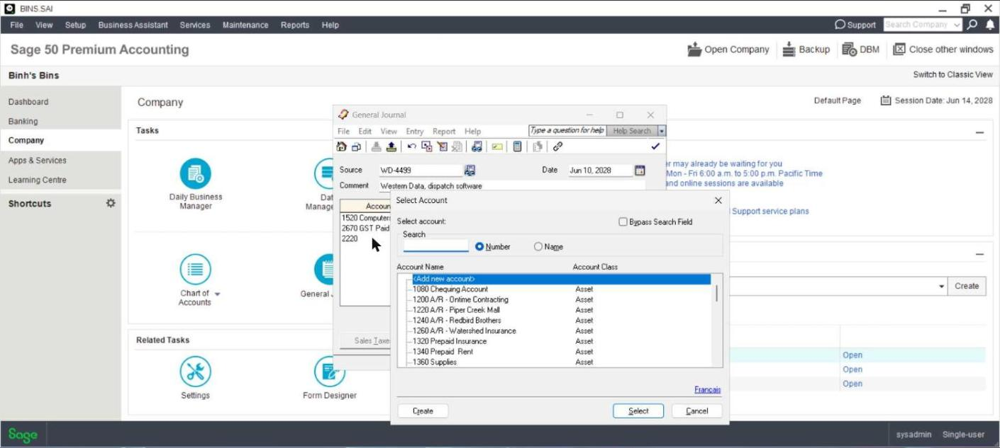" width="900"> <em>Figure 38. Select Account window with &lt;Add new account&gt;</em>

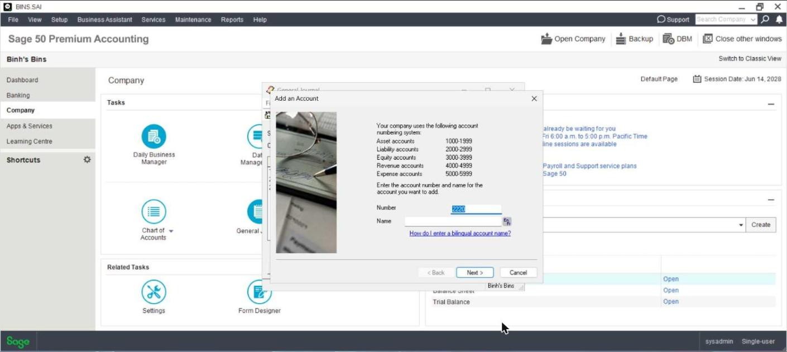 <em>Figure 39. Add an Account wizard: account number and name</em>

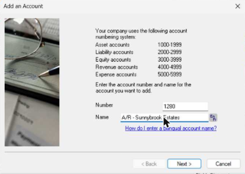 <em>Figure 40. Account number and name (1280 A/R - Sunnybrook Estates)</em>

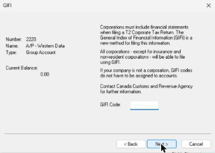 <em>Figure 41. GIFI code page, left blank</em>

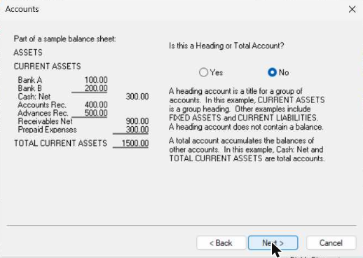 <em>Figure 42. Heading or Total account: No</em>

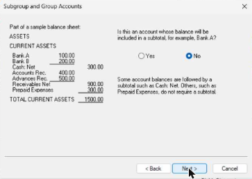 <em>Figure 43. Subgroup account: No</em>

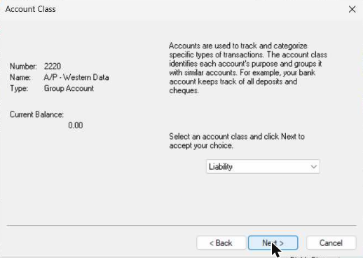 <em>Figure 44. Account class: Liability</em>

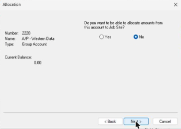 <em>Figure 45. Allocation: No</em>

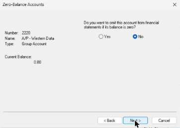 <em>Figure 46. Omit when balance is zero: No</em>

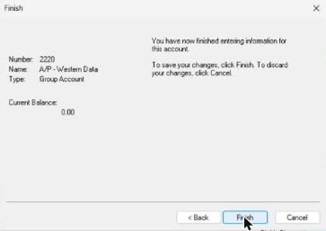 <em>Figure 47. Finish</em>

## 6. Corrections to posted entries

Two posted entries were found to carry the wrong amount. Neither was deleted. Each was corrected with **Adjust a Previously Posted Entry**, which posts a reversing entry and a corrected entry so the original, the reversal and the correction all remain in the journal.

| Memo | Document | Was | Corrected to | Original | Reversal | Correction |
|---|---|---|---|---|---|---|
| Memo #1 | Purchase invoice BH-5621 | 162.75 | 178.50 | J1 | J4 | J5 |
| Memo #4 | Cheque #492 | 842.00 | 882.00 | J19 | J29 | J30 |

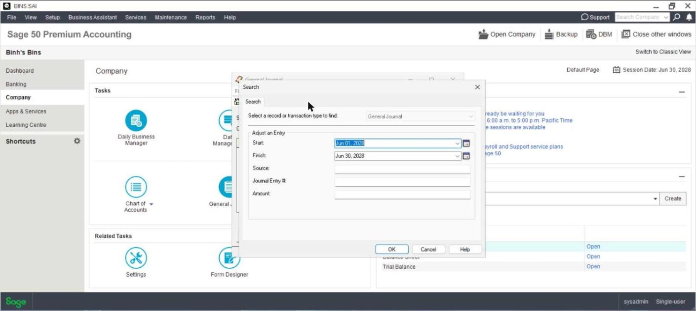 <em>Figure 48. Search window used to locate the posted entry by source</em>

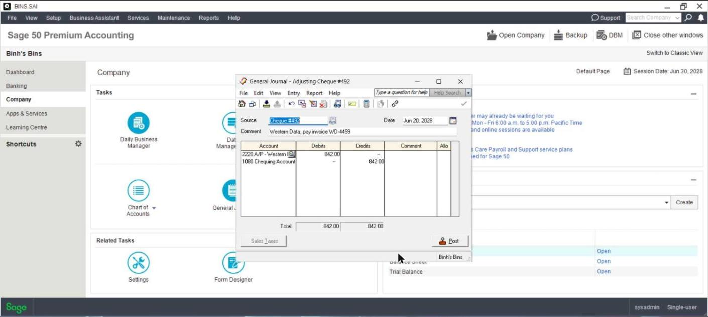 <em>Figure 49. Cheque #492 opened for adjustment at the original amount of 842.00</em>

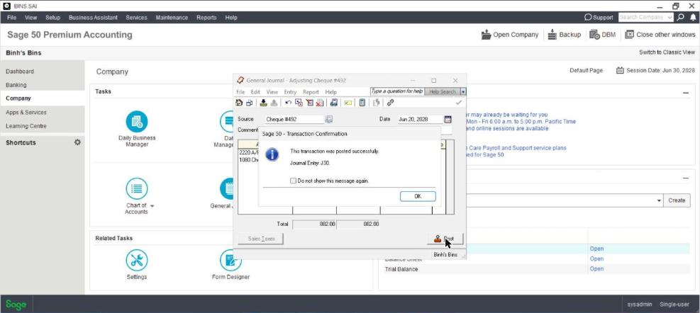 <em>Figure 50. Corrected entry posted as J30</em>

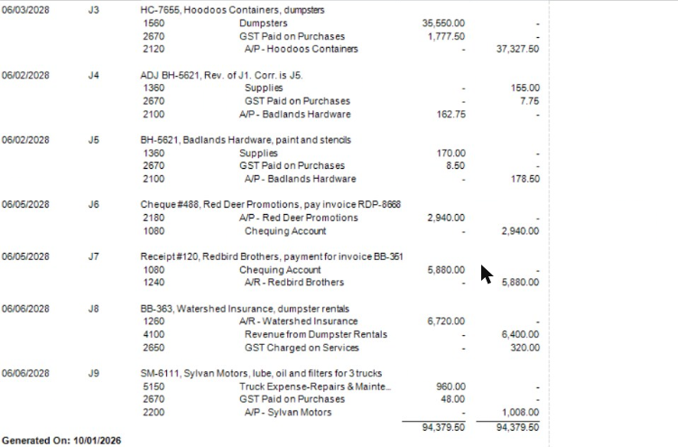 <em>Figure 51. General Journal: J4 reverses J1 ("Rev. of J1. Corr. is J5") and J5 carries the corrected amounts</em>

After the second correction the Western Data payable is fully cleared and the chequing balance is 40.00 lower than the uncorrected cheque would have left it.

## 7. Backups

A separately named local backup was taken at the end of each session, with Verify Backup File enabled, so that any session can be restored without overwriting an earlier one.

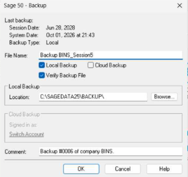 <em>Figure 52. Backup dialog with a session-specific file name</em>

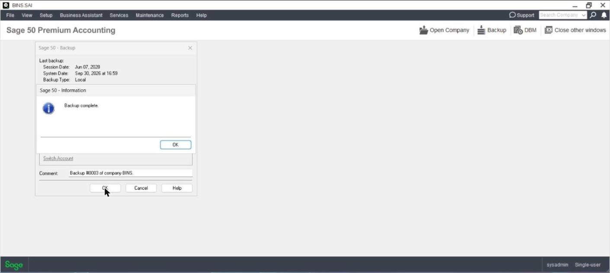 <em>Figure 53. Backup complete</em>

## 8. Reporting

At month end the following reports were run from the Reports menu and exported to PDF.

| Report | Menu path | Settings |
|---|---|---|
| General Journal | Journal Entries > General | Jun 01 to Jun 30, 2028, corrections shown |
| Trial Balance | Financials > Trial Balance | As at Jun 30, 2028 |
| Income Statement | Financials > Income Statement | Jan 01 to Jun 30, 2028 |
| Comparative Balance Sheet | Financials > Balance Sheet | Jun 30 vs Jun 01, 2028, difference in percentage |
| General Ledger | Financials > General Ledger | Jun 01 to Jun 30; accounts 1080, 2650, 3100, 4100 |
| Chart of Accounts | Lists > Chart of Accounts | Current year |
| Account List | Lists > Accounts | As of Jun 30, 2028 |

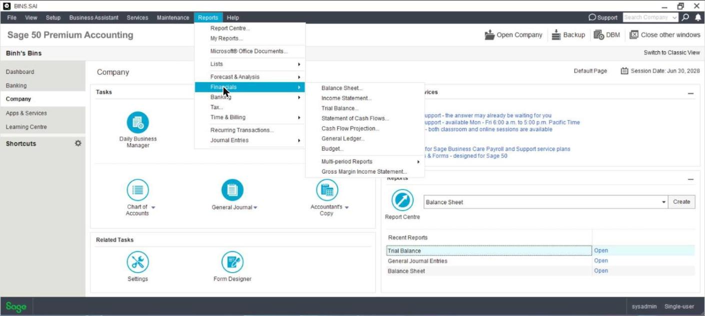 <em>Figure 54. Reports menu, Financials submenu</em>

### General Journal

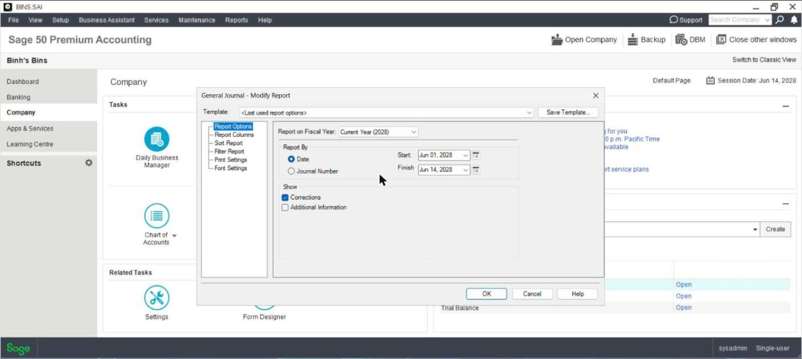 <em>Figure 55. General Journal report options with Corrections selected</em>

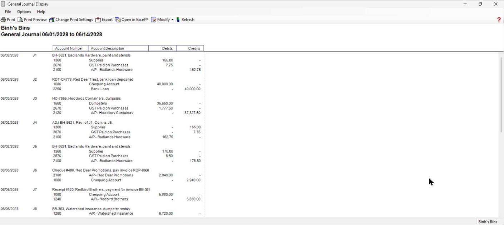 <em>Figure 56. General Journal, J1 to J8</em>

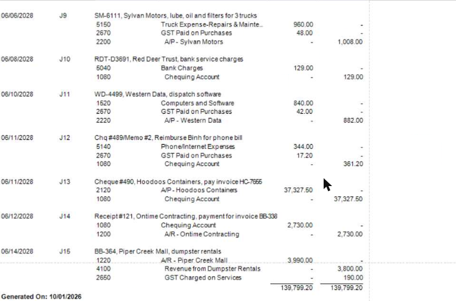 <em>Figure 57. General Journal, J9 to J15</em>

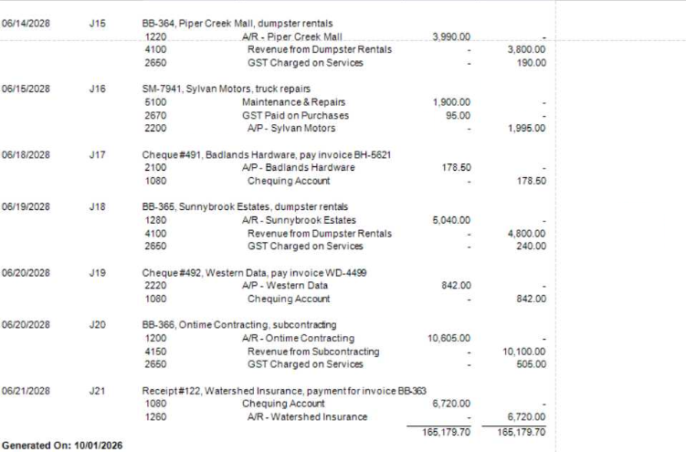 <em>Figure 58. General Journal, J15 to J21</em>

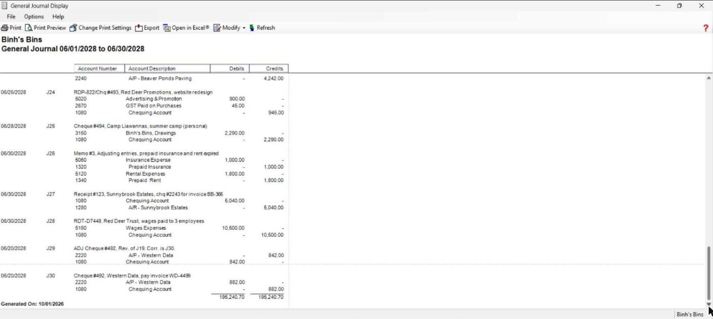 <em>Figure 59. General Journal, J24 to J30, with report total 195,240.70</em>

### Trial Balance

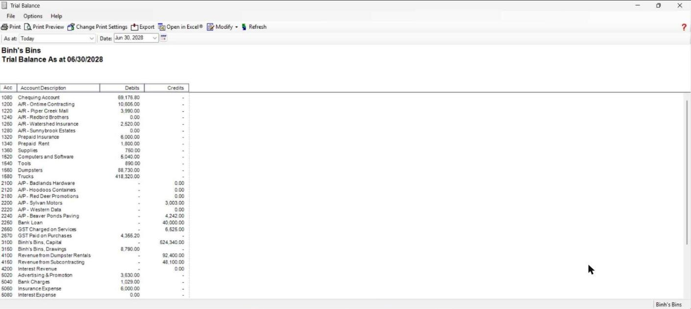 <em>Figure 60. Trial Balance as at Jun 30, 2028</em>

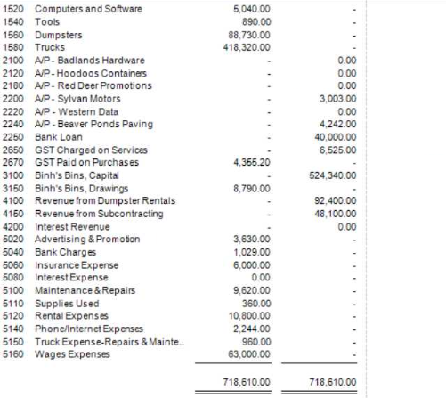 <em>Figure 61. Trial Balance totals: 718,610.00 on both sides</em>

### Income Statement

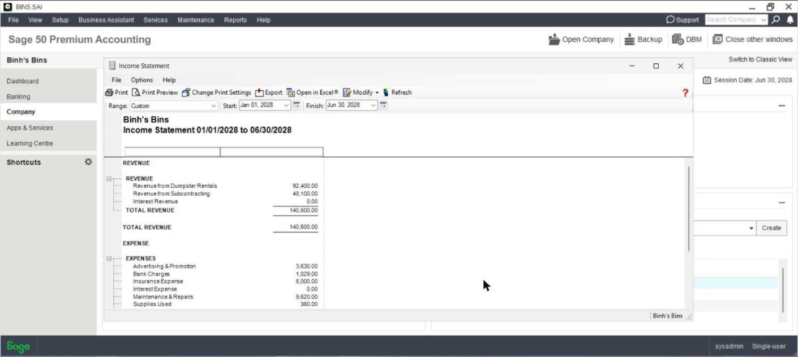 <em>Figure 62. Income Statement, Jan 01 to Jun 30, 2028</em>

### Comparative Balance Sheet

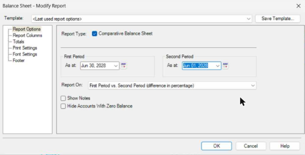 <em>Figure 63. Comparative Balance Sheet options</em>

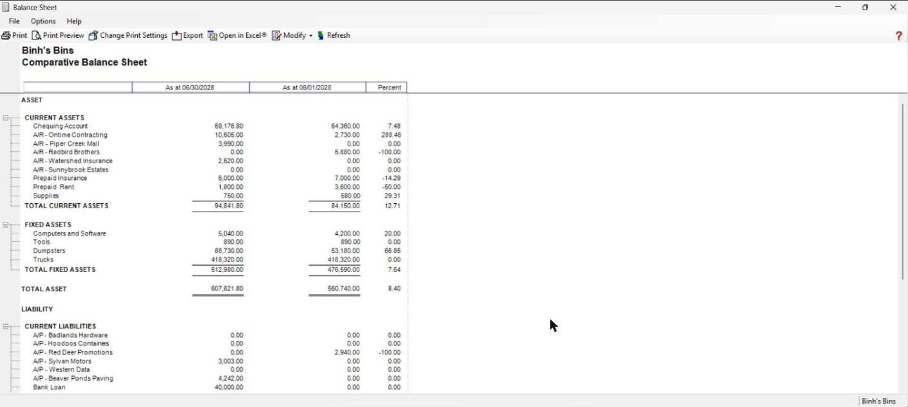 <em>Figure 64. Comparative Balance Sheet with percentage change</em>

### General Ledger

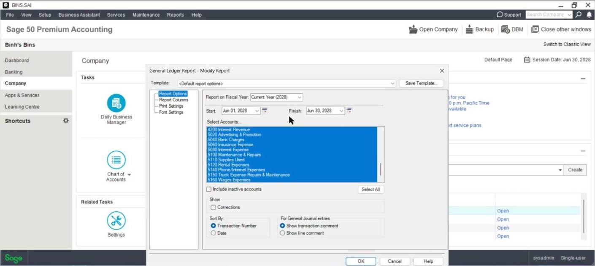 <em>Figure 65. General Ledger report options and account selection</em>

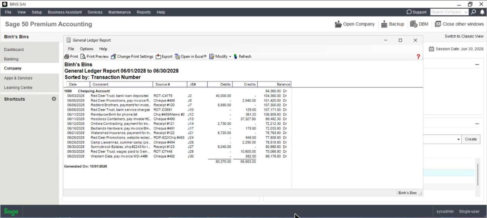 <em>Figure 66. General Ledger, 1080 Chequing Account</em>

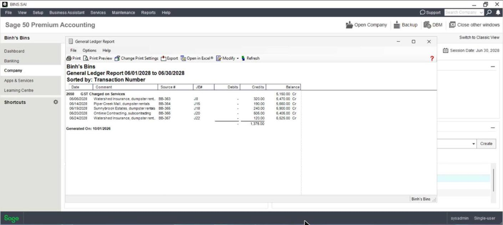 <em>Figure 67. General Ledger, 2650 GST Charged on Services</em>

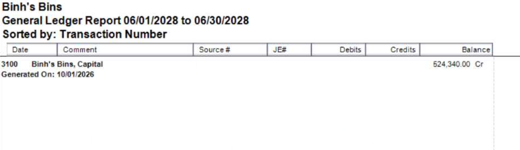 <em>Figure 68. General Ledger, 3100 Capital (no activity in June)</em>

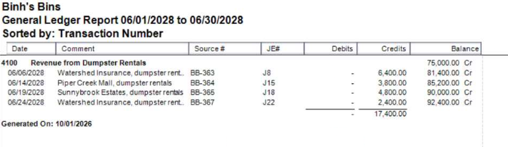 <em>Figure 69. General Ledger, 4100 Revenue from Dumpster Rentals</em>

### Chart of Accounts and Account List

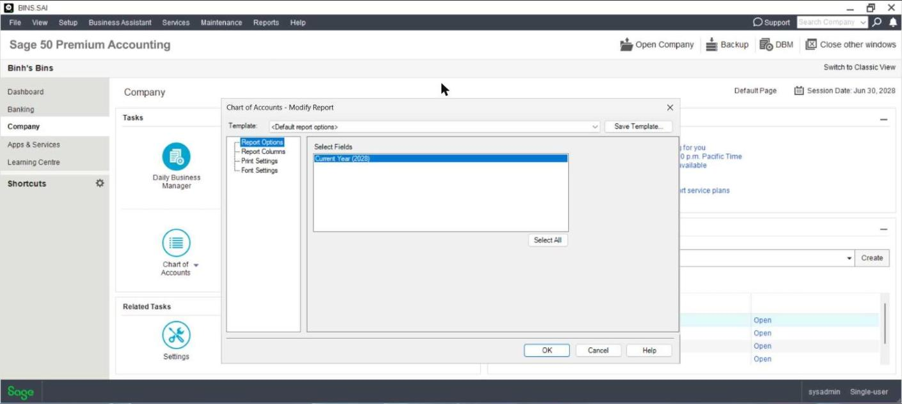 <em>Figure 70. Chart of Accounts report options</em>

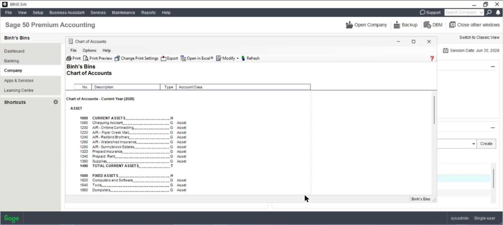 <em>Figure 71. Chart of Accounts</em>

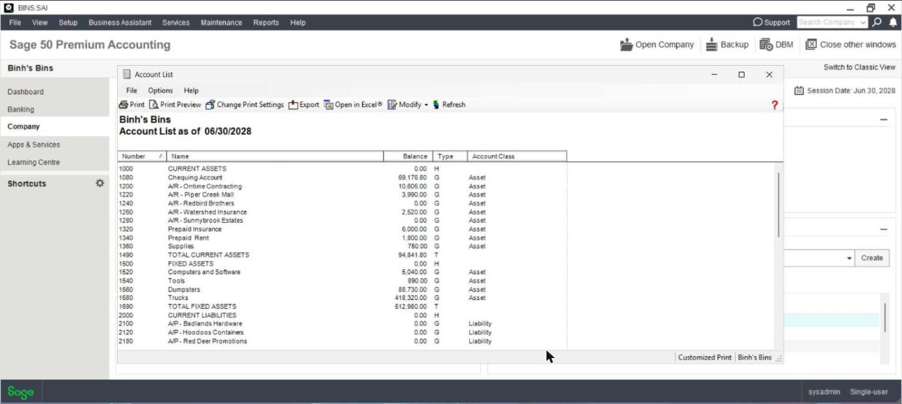 <em>Figure 72. Account List with balances as of Jun 30, 2028</em>

### PDF export

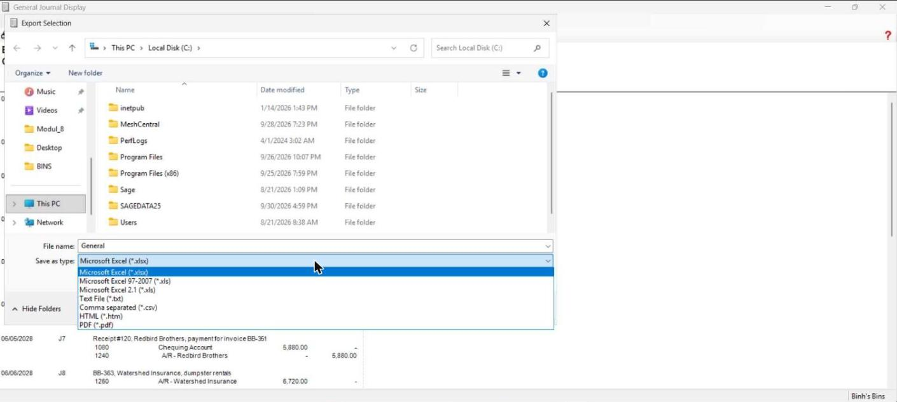 <em>Figure 73. Export dialog: PDF selected as the file type</em>

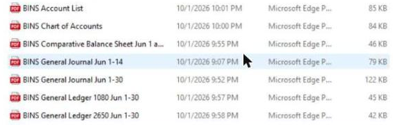 <em>Figure 74. Exported report files (1 of 2)</em>

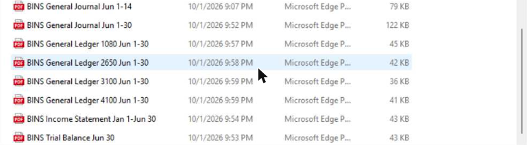 <em>Figure 75. Exported report files (2 of 2)</em>

### Control totals

| Check | Amount |
|---|---:|
| General Journal total, Jun 1 to Jun 30 (corrections shown) | 195,240.70 |
| Trial Balance total, Jun 30 | 718,610.00 |
| 1080 Chequing Account | 69,176.80 |
| Total assets | 607,821.80 |
| Total revenue, Jan 1 to Jun 30 | 140,500.00 |
| 2650 GST Charged on Services | 6,525.00 |
| A/P - Sylvan Motors | 3,003.00 |
| A/P - Beaver Ponds Paving | 4,242.00 |
| A/P - Western Data | 0.00 |

## 9. Skills demonstrated

- **Double-entry bookkeeping.** Recorded 28 transactions as balanced journal entries across asset, liability, equity, revenue and expense accounts.
- **Accounts payable.** Entered supplier invoices on credit, paid them by cheque and cleared each payable to zero.
- **Accounts receivable.** Entered sales invoices on credit, recorded customer receipts and cleared each receivable.
- **Sales tax (GST).** Separated 5% GST on purchases and sales into the correct paid and charged accounts and checked each amount.
- **Bank transactions.** Recorded a bank loan, service charges, wages paid by bank debit and cheque payments.
- **Month-end adjusting entries.** Expensed one month of prepaid insurance and prepaid rent with a compound entry.
- **Owner equity.** Recorded a personal payment as owner drawings instead of a business expense.
- **Error correction and audit trail.** Corrected two posted entries through reversing entries so the original and the correction both stay on record.
- **Chart of accounts maintenance.** Created six new accounts with the correct class and structure while entering transactions.
- **Financial reporting.** Produced a General Journal, Trial Balance, Income Statement, Comparative Balance Sheet, General Ledger, Chart of Accounts and Account List.
- **Reconciliation and review.** Checked journal and trial balance totals after every session and traced account balances back to entries.
- **Data protection.** Took a verified, separately named backup at the end of each session.
- **Sage 50 Premium Accounting.** Session dates, General Journal, account wizard, entry adjustment, backup, report options and PDF export.
- **Documentation.** Wrote up the full process with source references, journal numbers and screenshots.
